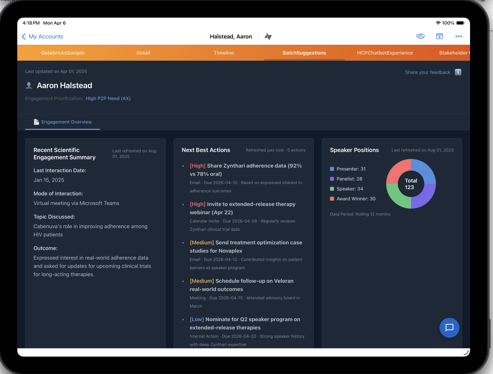

# Veeva CRM X-Page with Databricks AI/BI

A Veeva Vault CRM X-Page that embeds Databricks AI/BI Genie and SQL-powered Next Best Actions directly into the HCP engagement view.



## What It Does

This HTML page runs as a **Veeva Vault CRM X-Page** embedded in an HCP account record. It provides:

- **Next Best Actions** — Personalized recommended actions pulled in real-time from a Databricks Delta table via the SQL Statement Execution API
- **AI/BI Genie Chatbot** — Natural language queries over CRM and engagement data via a Databricks Genie Space
- **HCP Engagement Summary** — Scientific engagement history, speaker positions
- **Veeva Context Integration** — Automatically reads the current physician name from the Veeva X-Pages DataService API

## Architecture

```
┌─────────────────────────────────────────────────────────────┐
│  Veeva Vault CRM (browser)                                  │
│  ┌───────────────────────────────────────────────────────┐  │
│  │  GenieAndDBSQL.html (X-Page)                          │  │
│  │                                                       │  │
│  │  1. Reads HCP name from Veeva X-Pages DataService     │  │
│  │  2. Fetches Next Best Actions via Azure proxy          │  │
│  │  3. Sends Genie questions via Azure proxy              │  │
│  └───────────────┬───────────────────────────────────────┘  │
└──────────────────┼──────────────────────────────────────────┘
                   │ HTTPS (CORS-safe)
                   ▼
┌──────────────────────────────────────┐
│  Azure Web App (Token Server)        │
│  veeva-dbx-token-server.azurewebsites.net │
│                                      │
│  /api/token    → M2M OAuth token     │
│  /api/proxy/*  → Proxies all         │
│                  Databricks API calls │
│                  (injects auth token) │
└──────────────────┬───────────────────┘
                   │ Server-side (no CORS)
                   ▼
┌──────────────────────────────────────┐
│  Databricks Workspace (FEVM)         │
│                                      │
│  SQL Statement API                   │
│  ├─ next_best_actions table          │
│  └─ Any SQL query                    │
│                                      │
│  Genie Space API                     │
│  └─ Natural language → SQL → results │
│                                      │
│  Unity Catalog (governance)          │
│  SQL Warehouse (compute)             │
└──────────────────────────────────────┘
```

### Why the Azure Proxy?

Browsers enforce CORS (Cross-Origin Resource Sharing). The Veeva CRM page runs on `vcrmcdnreport.veevacrm.com`, which cannot directly call Databricks APIs at `*.cloud.databricks.com` — the browser blocks it.

The Azure Web App solves this by:
1. **Fetching OAuth tokens server-side** via M2M client credentials (no CORS restriction)
2. **Proxying all API calls** — the browser talks to Azure (which has CORS enabled), and Azure talks to Databricks
3. **Caching tokens** — the M2M token is cached and auto-refreshed, so the page never needs to handle auth

### Authentication Flow

```
Browser → GET /api/token → Azure fetches M2M OAuth token from Databricks OIDC → returns to browser
Browser → POST /api/proxy/api/2.0/sql/statements → Azure injects token, forwards to Databricks → returns results
```

The Service Principal credentials (client ID + secret) are stored as Azure App Service environment variables — never exposed to the browser.

## Setup

### Prerequisites

- Databricks workspace with Unity Catalog
- Databricks Service Principal with M2M OAuth secret
- Azure subscription for the token server
- Veeva Vault CRM with X-Pages enabled

### 1. Deploy the Token Server

See [ai-bi-token-server-az-webapp](https://github.com/tony-farias/ai-bi-token-server-az-webapp) for the Azure Web App deployment.

Required Azure App Service environment variables:

```
INSTANCE_URL=https://your-workspace.cloud.databricks.com
SERVICE_PRINCIPAL_ID=your-sp-client-id
SERVICE_PRINCIPAL_SECRET=your-sp-secret
WORKSPACE_ID=your-workspace-id
```

### 2. Create the Data

Create the `next_best_actions` table in Unity Catalog:

```sql
CREATE TABLE catalog.schema.next_best_actions (
  physician_name STRING,
  action STRING,
  priority STRING,    -- High, Medium, Low
  channel STRING,     -- Email, Meeting, Calendar Invite, Internal Action
  due_date STRING,
  rationale STRING
);
```

### 3. Grant Permissions

The Service Principal needs:
- `USE_CATALOG` + `USE_SCHEMA` + `SELECT` on the catalog
- `CAN_USE` on the SQL Warehouse
- `CAN_RUN` on the Genie Space

If the workspace has an IP Access List, add the Azure Web App's outbound IPs.

### 4. Configure the HTML

Edit `GenieAndDBSQL.html` and update:

```javascript
const CONFIG = {
    DATABRICKS_HOST: 'https://your-workspace.cloud.databricks.com',
    GENIE_SPACE_ID: 'your-genie-space-id',
    ...
};

const TOKEN_SERVER = '...' ||
    'https://your-token-server.azurewebsites.net';
```

Also update the SQL query in `loadNextBestActions()` to point to your table.

### 5. Upload to Veeva

1. In Veeva Vault CRM, go to **Admin > X-Pages**
2. Create a new X-Page
3. Upload `GenieAndDBSQL.html` as the page content
4. Configure the X-Page to appear on the **Account** record page
5. The page will automatically read the current HCP name via `ds.getDataForCurrentObject('account__v', 'name__v')`

### 6. Test Locally

```bash
# Open with the Azure token server (no local server needed)
open "GenieAndDBSQL.html?token_server=https://your-token-server.azurewebsites.net&physician_name=Aaron%20Halstead%2C%20MD"
```

## Files

| File | Description |
|------|-------------|
| `GenieAndDBSQL.html` | The X-Page HTML — complete single-file app with embedded CSS and JavaScript |
| `README.md` | This file |
| `screenshot.png` | Screenshot of the page running in Veeva CRM |

## Configuration Reference

| URL Parameter | Default | Description |
|---------------|---------|-------------|
| `token_server` | `https://veeva-dbx-token-server.azurewebsites.net` | Azure token server URL |
| `physician_name` | *(from Veeva API)* | Override physician name for testing |
| `host` | `https://fevm-serverless-stable-fariaton.cloud.databricks.com` | Databricks workspace URL |
| `genie_space` | `01f10f780c1a1aa791f20224db116c22` | Genie Space ID |
| `token` | *(auto-fetched)* | Manual token override (bypasses token server) |
